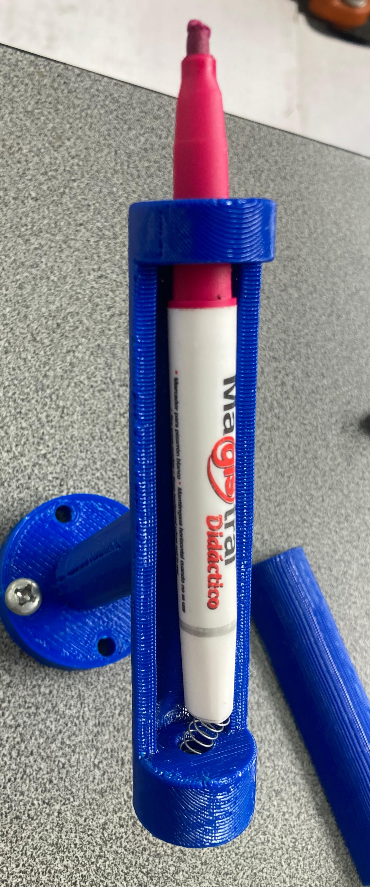

<table>
  <tr>
    <td>
      <h1>Laboratorio No. 01 - Robótica Industrial</h1>
      <h2> Trayectorias, Entradas y Salidas Digitales. </h2>
      <strong> Autores:</strong>
      <ul>
        <li>Daniel Mauricio Rivero Lozada </li>
      <li>Yeira Liseth Rodríguez Rodríguez</li>
      </ul>
    </td>
    <td>
      
    </td>
  </tr>
</table>

Sobre una superficie plana rectangular se escriben las letras de los nombres de cada uno de los integrantes del grupo y una decoración al gusto. En este caso se generaron los paths o los movimientos de robot necesarios para representar las letras y la decoración. Se tuvieron en cuenta las siguientes restricciones:

* El tamaño de la torta es para 20 personas
* Las trayectorias a desarrollar deberán realizarse en un rango de velocidades entre 100 y 1000.
* La zona tolerable de errores máxima debe ser de z10.
* El movimiento debe partir de una posición home especificada y realizar la trayectoria de cada palabra y decoración con un trazo continuo. El movimiento debe finalizar en la misma posición de home en la que se inició.
* Los nombres deben estar separados

## Descripción de la solución planteada.

## Diseño Herramienta.

Teniendo en cuenta lo anterior se empezó diseñando una herramienta por medio de un software CAD, tomando en cuenta las medidas del manual de usuario de ABB para el flanche del robot. Posteriormente, la pieza fue impresa en 3D y se le añadio un resorte para amortiguar la presión del marcador sobre el tablero. El resultado de cada etapa del proceso se muestra a continuación

  
  
  

## Diagrama de flujo de las acciones del robot.

  

## Descripción de las funciones utilizadas.

Para cumplir con el diagrama de flujo anterior se usa el condicional de **if-elseif** para establecer el inicio de cada rutina según las entradas. En general se utilizan los comandos **MoveL** (mueve el robot en una línea recta desde su posición actual hasta la posición objetivo especificada), **MoveJ** (mover el robot rápidamente de un punto a otro cuando no es imprescindible que el movimiento siga una línea recta) y **MoveC** (se usa para mover el robot describiendo un arco de círculo). Cada movimiento se asocia con puntos objetivo (**RobotTargets**) que definen la trayectoria deseada, así como un objeto de trabajo (el **tablero** y el **wobj0**). 

Por otro lado, para organizar las acciones del robot según los casos se crearon dos rutinas: **_Path_rutina()_** tiene como propósito ejecutar la secuencia de movimientos para escribir cada letra y dibujo según el diseño planteado, incluyendo los movimientos de levantar el marcador para el cambio de letra. **_Path_maintenance()_**  ejecuta un único movimiento que ubica el robot en una posición favorable para el operario para labores de mantenimiento.

## Plano de planta de la ubicación de cada uno de los elementos.

## Código en RAPID del módulo utilizado para el desarrollo de la práctica.

## Simulación

Con las trayectorias y rutinas ya definidas es posible simular los movimientos del robot en RobotStudio. Para ello se crearon dos superficies distintas y se adecuo el marco de usuario según el caso.

### Superficie plana

<iframe width="560" height="315" src="Videos/SimulaciónSuperficiePlana.mp4" frameborder="0" allow="autoplay; encrypted-media" allowfullscreen></iframe>

### Superficie inclinada a 30°

<iframe width="560" height="315" src="Videos/SimulaciónSuperficieInclinada.mp4" frameborder="0" allow="autoplay; encrypted-media" allowfullscreen></iframe>

## Implementación

### Superficie plana

  

### Superficie inclinada a 30°

Para la implementación se creó un soporte que garantizaba un ángulo de 30° del tablero que después fue fijado sobre la base.

  

